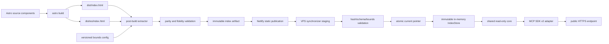
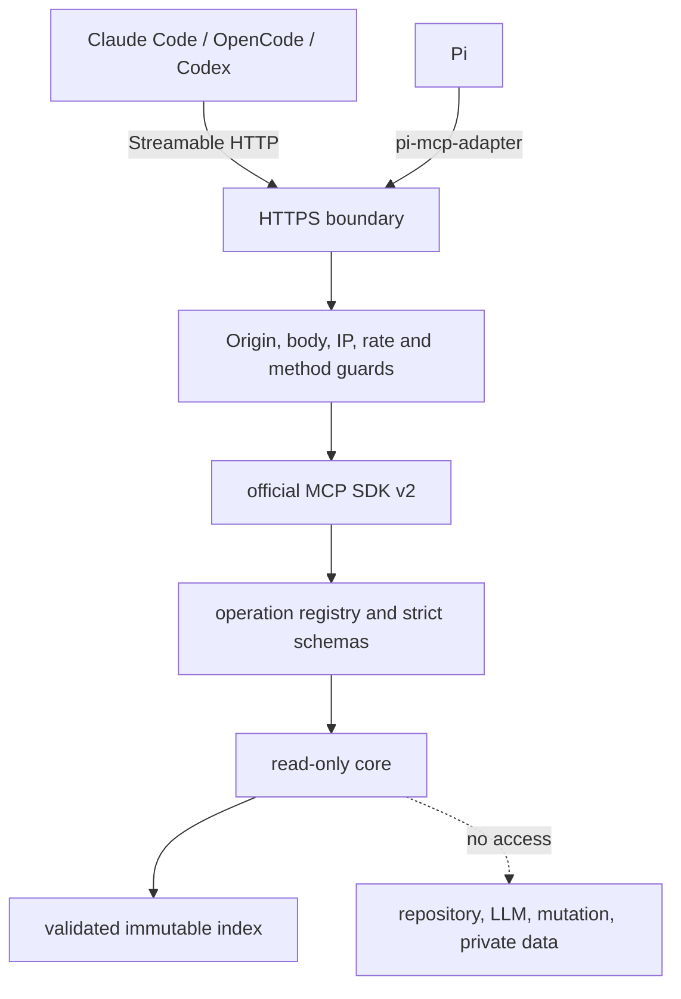
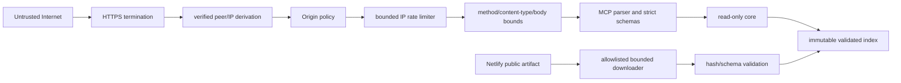
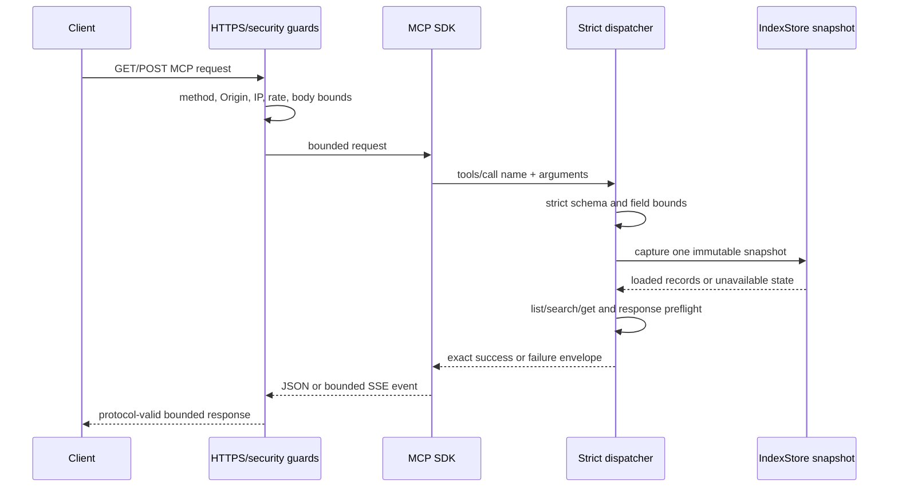

# Technical Design: Public MCP documentation interface

## Decision summary

The existing Astro pages remain the only documentation authority. After `astro build`, a deterministic Node extractor reads `dist/index.html` and `dist/es/index.html`, validates the complete H2/H3 hierarchy, converts each exact section to normalized Markdown and sanitized HTML, and publishes a content-addressed v1 index under Netlify's static `dist/` output.

A separate Node 20+ service on the HostGator VPS loads only validated index artifacts. One shared read-only core implements listing, search, and exact retrieval. The official MCP TypeScript SDK v2 exposes that core through one Streamable HTTP endpoint while retaining the SDK's supported legacy protocol negotiation. The service has no repository checkout, LLM, mutation capability, API key, or OAuth boundary.

Production synchronization pulls the Netlify manifest and immutable artifact into a staging directory, validates every schema, bound, and hash, then atomically switches a `current` pointer. Invalid replacements never displace the last known good index. The static website and browser search remain independent.

## Goals and constraints

| Area | Design constraint |
| --- | --- |
| Authority | Only rendered Astro output from `/` and `/es/` supplies evidence. |
| Determinism | No timestamps, random values, host paths, or deployment IDs participate in source or index identity. |
| Retrieval | Exactly three stable operations; exact H2/H3 addressing; Markdown default; sanitized HTML opt-in. |
| Public transport | HTTPS Streamable HTTP, strict schemas, finite bounds, Origin policy, verified client IP, and rate limiting. |
| Hosting | Netlify publishes static artifacts; HostGator VPS runs the production Node service. |
| Compatibility | Official MCP TypeScript SDK v2 on Node 20+; supported legacy negotiation remains enabled. |
| Preservation | Existing routes, canonical metadata, Mermaid rendering, and browser search implementation remain independent. |
| Delivery | Auto-chained review units remain below 400 authored changed lines and include their tests. |

WebMCP, Netlify Edge, server-side LLM behavior, repository commands, authentication, private content, broad content migration, and native Pi MCP are outside this design.

## Current placement facts

- Astro 7.2.4 emits plain static output to `dist/`; `netlify.toml` publishes that directory with `npm run build`.
- `/` and `/es/` render `DocumentationContentEn.astro` and `DocumentationContentEs.astro` through `DocumentationPage.astro`.
- Both content components currently contain the same explicit H2/H3 identifier sequence. Existing Playwright checks sample parity but do not validate the complete hierarchy.
- `BaseLayout.astro` emits absolute locale-specific canonical links.
- `src/scripts/site.js` builds a separate browser-only DOM search index. Its empty-query and result-limit behavior intentionally differs and will not be imported by the MCP core.
- CI uses Node 22, `npm run check`, `npm run build`, and `npx playwright test`. Node 22 satisfies the service's Node 20+ floor.

## Architecture





## Module and file placement

The repository remains a single npm package; adding a workspace solely for this feature would add release and build complexity without creating an independent product boundary. `CURRENT` means verified in the repository at design time. `PROPOSED` means an additive path or file that this change may introduce; it does not exist yet and is not evidence of implementation.

| Status | Path | Responsibility |
| --- | --- | --- |
| PROPOSED | `config/docs-mcp/bounds.v1.json` | Mandatory versioned publication, request, response, rate, session, and synchronization bounds. |
| PROPOSED | `src/docs-mcp/contracts/bounds.ts` | Strict bounds schema and `BoundsMetadata` projection. |
| PROPOSED | `src/docs-mcp/contracts/index.ts` | Generated-index v1 schemas and canonical identity validation. |
| PROPOSED | `src/docs-mcp/contracts/operations.ts` | Strict request, success, record, and closed failure-envelope schemas. |
| PROPOSED | `src/docs-mcp/indexer/extract.ts` | Parse built locale pages and form exact H2/H3 section boundaries. |
| PROPOSED | `src/docs-mcp/indexer/content.ts` | URL resolution, sanitization, plain text, Markdown, and Mermaid conversion. |
| PROPOSED | `src/docs-mcp/indexer/identity.ts` | Canonical serialization and SHA-256 domain-separated identities. |
| PROPOSED | `src/docs-mcp/indexer/generate.ts` | Full parity, bounds, reproducibility, and publication orchestration. |
| PROPOSED | `scripts/docs-mcp/generate-index.ts` | Thin post-build CLI; writes only inside `dist/.well-known/gentle-ai/docs-mcp/`. |
| PROPOSED | `src/docs-mcp/core/index-store.ts` | Validated `loaded`/`unavailable` state and atomic immutable snapshots. |
| PROPOSED | `src/docs-mcp/core/list.ts` | Ordered section listing. |
| PROPOSED | `src/docs-mcp/core/search.ts` | Normalization, ranking, deterministic snippets, and limits. |
| PROPOSED | `src/docs-mcp/core/get.ts` | Exact retrieval and opt-in descendant expansion. |
| PROPOSED | `src/docs-mcp/core/dispatch.ts` | Closed operation registry and identity-correct envelopes. |
| PROPOSED | `src/docs-mcp/server/security.ts` | Origin, verified IP, method, body, session, and rate-limit guards. |
| PROPOSED | `src/docs-mcp/server/mcp.ts` | SDK v2 handlers and modern/legacy protocol negotiation. |
| PROPOSED | `src/docs-mcp/server/http.ts` | Node HTTP/HTTPS listeners, response-byte enforcement, health routes. |
| PROPOSED | `src/docs-mcp/server/observability.ts` | Structured logs and bounded metrics. |
| PROPOSED | `src/docs-mcp/server/main.ts` | Startup validation, readiness, reload, and graceful shutdown. |
| PROPOSED | `src/docs-mcp/sync/synchronize.ts` | Netlify pull, staging validation, atomic activation, and rollback pointers. |
| PROPOSED | `scripts/docs-mcp/sync-index.ts` | Supervisor/timer-neutral synchronization CLI. |
| PROPOSED | `tests/node/docs-mcp/**` | Focused Vitest tests and malicious/rich HTML fixtures. |
| CURRENT | `tests/docs.spec.ts` | Existing browser regressions; proposed edits add static artifact publication checks. |
| PROPOSED | `tests/smoke/docs-mcp/**` | Protocol and named-client smoke drivers; no compatibility claim from fixtures alone. |
| PROPOSED | `ops/docs-mcp/` | Host-neutral runbook, release layout, gates, recovery, and the selected supervisor/TLS adapter after confirmation. |
| PROPOSED | `docs/mcp-client-compatibility.md` | Evidence ledger format and qualification rules for named clients. |

`package.json` and `playwright.config.ts` are CURRENT files proposed for modification: the former adds `astro build && npm run docs:mcp:index` plus focused Node test/build scripts while retaining the current Playwright command; the latter explicitly matches browser `*.spec.ts` files so proposed Vitest `*.test.ts` files are not collected by Playwright. `tsconfig.docs-mcp.json` and its `build/docs-mcp/` output are PROPOSED additions. The broader `config/docs-mcp/`, `src/docs-mcp/`, `scripts/docs-mcp/`, `tests/node/docs-mcp/`, `tests/smoke/docs-mcp/`, and `ops/docs-mcp/` trees are therefore all PROPOSED, not current repository structure.

## Dependency decisions

All entries below are PROPOSED direct dependencies to be declared explicitly in `package.json` and locked by `package-lock.json`; none is represented as an already approved direct dependency. In particular, the repository currently receives `zod` only transitively, so implementation must add and lock it directly rather than rely on transitive resolution. Major-version ranges are not used for production protocol or conversion dependencies.

| Proposed direct dependency | Use and rationale |
| --- | --- |
| `@modelcontextprotocol/server` v2 | Official Streamable HTTP server and supported modern/legacy protocol negotiation; Node 20+ is the runtime floor. |
| `zod` | Direct strict `.strict()` request, config, index, and response schemas, aligned with SDK schemas. |
| `cheerio` | Deterministic server-side traversal of built HTML without a browser runtime. |
| `sanitize-html` | Explicit allowlist sanitization and URL-scheme enforcement before either representation is stored. |
| `turndown` + `turndown-plugin-gfm` | Deterministic HTML-to-Markdown conversion with fenced code and GFM table preservation. |
| `json-canonicalize` | Canonical object serialization before SHA-256 identity calculation. |
| `pino` | Bounded structured JSON logs to stdout without content logging. |
| `prom-client` | In-process counters, gauges, and bounded histograms on a loopback-only metrics listener. |
| `vitest` | Focused TypeScript unit/integration feedback, fake clocks, and isolated temporary-directory tests. |
| `tsx` | Runs TypeScript build/synchronization CLIs without adding a second source dialect. |

Node's built-in `http`, `https`, `crypto`, `URL`, filesystem, and atomic rename primitives require no package declaration. Express, a database, a search engine, and a server-side DOM browser are unnecessary.

## Generated index design

### Build sequence

1. `astro build` must successfully produce `dist/index.html` and `dist/es/index.html`.
2. The generator loads and validates `config/docs-mcp/bounds.v1.json` before reading potentially large outputs.
3. Each page is read with a byte ceiling, parsed, and required to contain exactly one `main#contenido` and one HTTPS canonical URL.
4. Every `main#contenido h2[id], h3[id]` must have a non-empty unique ID. A leading H3, missing ID, duplicate ID, unsupported heading level, or structurally ambiguous boundary fails generation.
5. An H2 record spans from its heading through the node before the next H2 or H3. An H3 record spans from its heading through the node before the next H2 or H3. Descendants are therefore independent records rather than duplicated inside the parent body.
6. For each locale, the generator records document ordinal, `parent_id`, and hierarchy (`[h2_id]` or `[h2_id, h3_id]`).
7. It compares the complete ordered tuples `(id, level, parent_id, ordinal)` across locales. Missing, extra, reordered, duplicate, level-drifted, or reparented records fail publication.
8. Content conversion, schema validation, per-record bounds, total-record bounds, and serialized-index bounds run before any public file is written.
9. The generator writes a temporary immutable artifact and manifest, fsyncs where supported, then renames them into the static publication directory. A failure removes staging and leaves no partial manifest.

### Rich-content conversion

For each exact boundary, conversion follows one pipeline:

1. Clone the section nodes; remove scripts, styles, template/noscript content, generated anchor/copy controls, form controls, and all event attributes.
2. Convert Mermaid containers to inert fenced `mermaid` code evidence before sanitization. No Mermaid script or rendered SVG is indexed.
3. Resolve `href` and allowed `src` values with the WHATWG `URL` API against the locale page canonical. Fragment-only links retain the locale page. Relative links become absolute. Invalid URLs and protocols other than `https:`, `http:` for existing authored links, and `mailto:` for anchors are removed; executable/data URLs are rejected. Canonical section URLs are always HTTPS and use the validated page canonical plus `#id`.
4. Sanitize through a fixed allowlist covering headings, paragraphs, emphasis, links, pre/code, ordered/unordered lists, blockquotes, definition lists, tables, and safe images. Only semantic attributes (`id`, safe `href`, `src`, `alt`, table span attributes, and validated `language-*` classes) survive.
5. Serialize sanitized HTML with LF line endings and stable attribute handling.
6. Convert that same sanitized HTML to Markdown with GFM tables and fenced code. Normalize line endings, remove trailing whitespace, collapse converter-only excessive blank lines, and end with exactly one newline.
7. Derive plain search text from the sanitized tree with semantic separators for cells, list items, paragraphs, terms, and headings. It is not used as exact evidence.

Representative fixtures include links, relative fragments, fenced code, lists, tables, definition lists, Mermaid, malformed markup, scripts, event handlers, unsafe URLs, and both locales. Any fidelity failure blocks the index rather than falling back to plain text.

### Schema and identity

The v1 artifact is one canonical JSON object:

```json
{
  "schema_identity": "gentle-ai.docs-mcp-index/v1",
  "source_identity": "sha256:<rendered-page-content-hash>",
  "source_version": "astro-render-sha256:<same-content-hash>",
  "index_identity": "sha256:<canonical-index-payload-hash>",
  "index_version": "gentle-ai.docs-mcp-index/v1",
  "bounds_config_version": "gentle-ai.docs-mcp-bounds/v1",
  "bounds": {},
  "locales": { "en": [], "es": [] }
}
```

Each locale record contains `locale`, `id`, `title`, `level`, `parent_id`, `hierarchy`, `ordinal`, `canonical_url`, `markdown`, `html`, `plain_text`, and the four required source/index identity/version fields.

Identity rules are domain-separated:

- `source_identity` hashes `docs-mcp-source/v1\0/\0<exact English bytes>\0/es/\0<exact Spanish bytes>`.
- `source_version` is content-derived, not a Git SHA or timestamp, so identical rendered bytes reproduce the same version.
- `index_identity` hashes canonical JSON after conversion and validation, excluding every top-level and record-level `index_identity` field to avoid a self-reference. The final identity is then stamped into the top level and every record and the completed object is validated again.
- `index_version` names the schema/algorithm contract. Any incompatible schema, extraction, sanitization, canonicalization, or ranking-input change requires v2 rather than silently changing v1 identity semantics.

Netlify publishes:

```text
dist/.well-known/gentle-ai/docs-mcp/manifest.v1.json
dist/.well-known/gentle-ai/docs-mcp/indexes/<index_identity>.json
```

The manifest contains schema identity, immutable relative URL, index/source identities and versions, bounds version, exact byte size, and SHA-256. It contains no timestamp. Netlify serves the manifest with revalidation/no-cache semantics and immutable artifacts with long-lived immutable caching. Generated output lives only in `dist/`, is never committed, and carries `generated_from` metadata. CI deletes it before generation and verifies a second generation has identical bytes. Manual index editing is prohibited and cannot become an input.

### Mandatory bounds v1

The initial values are explicit implementation safety limits, not estimates hidden in code:

| Bound | v1 value |
| --- | ---: |
| `query_characters` | 256 Unicode code points |
| `identifier_characters` | 128 Unicode code points |
| `option_bytes` | 512 UTF-8 bytes |
| `request_bytes` | 65,536 bytes |
| `response_bytes` | 524,288 bytes |
| `result_count` | 20 |
| `search_default_results` | 8 |
| `search_max_results` | 20 |
| `snippet_characters` | 320 Unicode code points |
| `section_body_bytes` | 196,608 bytes per representation |
| `serialized_evidence_bytes` | 393,216 bytes per operation result |
| `error_message_characters` | 256 Unicode code points |
| `index_record_count` | 512 total locale records |
| `serialized_index_bytes` | 16,777,216 bytes |
| `rate_limit_requests` | 60 per verified IP |
| `rate_limit_window_seconds` | 60 seconds |

The versioned contract also declares the initial internal v1 profile below. These values are conservative for one VPS process and are configuration, not a new public capability. The service validates every value before binding listeners; the synchronizer validates its applicable values before network or filesystem mutation. Missing, unknown, non-integral, zero, negative, or non-finite values fail startup/readiness, except `synchronization_redirect_count`, whose only valid v1 value is zero.

| Internal bound | Kind | Initial v1 value | Enforcement and single-VPS rationale |
| --- | --- | ---: | --- |
| `maximum_concurrent_sessions` | Hard safety/correctness bound | 64 sessions | The 65th session is rejected before allocation; 64 limits sockets and per-session state while leaving useful client concurrency. |
| `session_ttl_seconds` | Hard safety/correctness bound | 900 seconds | Idle/abandoned session state expires at 15 minutes, limiting memory retention without forcing frequent reconnects. |
| `sse_connection_duration_seconds` | Hard safety/correctness bound | 300 seconds | A stream closes at five minutes and clients reconnect, preventing indefinitely held VPS connections. |
| `maximum_sse_events` | Hard safety/correctness bound | 256 events per connection | Event 257 is not queued; the stream closes through the bounded transport path before event memory can grow without limit. |
| `index_synchronization_timeout_seconds` | Operational deadline | 30 seconds per attempt | The fetch is aborted and the last-known-good index remains active, bounding a hung Netlify/network attempt. |
| `synchronization_redirect_count` | Hard safety/correctness bound | 0 redirects | Any redirect is rejected, preserving the fixed-origin SSRF boundary. |
| `retained_index_versions` | Hard safety/correctness bound | 3 validated versions | Current, previous, and one additional recovery version fit a small rollback window; oldest inactive versions are removed only after activation succeeds. |
| `startup_deadline_seconds` | Operational readiness SLO/deadline | 30 seconds | Missing the deadline leaves the process unready and causes a supervised startup failure instead of hanging indefinitely. |
| `reload_deadline_seconds` | Operational readiness SLO/deadline | 10 seconds | Missing the deadline rejects the candidate swap and preserves the active snapshot, favoring availability and identity consistency. |

Hard safety/correctness bounds are never exceeded or softened at runtime: capacity is rejected, expired state is removed, and over-bound streams/artifacts are not partially served. Operational deadlines are fail-closed defaults/SLOs for completing sync, startup, or reload; expiry changes readiness or rejects the candidate but never replaces a valid active snapshot with partial state. Operators may tune these values only by supplying a complete supported versioned bounds contract; a changed profile receives a new `bounds_config_version` and exact compatibility/boundary evidence. The public operation `BoundsMetadata` remains exactly the fields required by the retrieval specification, including search default 8 and maximum 20. The index and operation envelopes expose the applicable `bounds_config_version`; `/health/ready` exposes that version plus a closed deadline/capacity reason, and loopback-only metrics expose configured internal limits and observed capacity/deadline outcomes without client content or unbounded labels.

## Shared read-only core

### IndexStore state

`IndexStore` exposes an immutable discriminated union:

```ts
type IndexState =
  | { status: 'loaded'; snapshot: ValidatedIndex; activatedAt: string }
  | { status: 'unavailable'; reason: 'missing' | 'malformed' | 'stale' | 'service'; detailCode: string };
```

A loaded snapshot is deep-frozen and swapped by reference only after complete validation. Every operation captures one snapshot reference at dispatch, so one response cannot mix identities during reload. Loaded-index validation/not-found/bounds errors retain that snapshot's service, schema, source, index, and bounds identities. Missing, malformed-at-startup, hard-stale, or service-unavailable states set source/index identities and versions to `null`, bounds to `null` when bounds are unavailable, and `index_identity_status: "unavailable"`; identities are never inferred from filenames.

A malformed replacement during synchronization does not invalidate an already loaded last-known-good snapshot. It is a synchronization failure, not a fabricated `index_malformed` response for the still-valid active snapshot. If no valid snapshot exists, missing input maps to `index_unavailable`, invalid input maps to `index_malformed`, and startup remains unready.

### Exact operation contracts

Requests are strict objects and reject undeclared fields:

```ts
list_documentation_sections({ locale: 'en' | 'es' })
search_documentation({ locale: 'en' | 'es', query: string, limit?: positiveInteger })
get_documentation_section({
  locale: 'en' | 'es',
  section_id: string,
  format?: 'markdown' | 'html',
  include_descendants?: boolean
})
```

The success and failure envelopes are exactly the specification shapes. Record `hierarchy` is `string[]`; all returned section/search/content records also carry `locale`, which the requirement prose mandates. `format` defaults to `markdown`; `include_descendants` defaults to `false`. No aliases or fourth tool are advertised.

The closed error codes are:

```text
invalid_request, unsupported_locale, invalid_query, invalid_limit,
invalid_format, invalid_section_id, section_not_found, bounded_input,
bounded_response, origin_not_allowed, method_not_allowed, rate_limited,
index_unavailable, index_malformed, service_unavailable
```

Messages come from a static catalog with bounded interpolation only for safe enum values. Queries, section bodies, IP addresses, paths, and parse errors are never reflected.

For a recognized operation, failures set `operation` to that operation and `requested_operation` to `null`. A bounded unknown `tools/call` name sets `operation: null`, echoes only the already-bounded name as `requested_operation`, and returns `invalid_request`. A request whose bounded operation name cannot be established sets both fields to `null`. Success and error schemas are mutually exclusive.

### Listing

Listing filters the captured snapshot by locale and returns records sorted by stored `ordinal`. It does not derive order from object-key order. Because pagination is outside scope, a list that cannot fit `serialized_evidence_bytes` or `response_bytes` fails with `bounded_response`; it is never truncated.

### Search

Search runs only after strict input and byte/code-point checks:

1. Trim Unicode whitespace; reject an empty result.
2. Normalize query, title, and plain text with Unicode NFKD, remove combining marks, lowercase, and collapse whitespace.
3. Assign exactly one rank: title prefix `0`, title substring `1`, body-only substring `2`; non-matches are removed.
4. Sort by rank then immutable document `ordinal`; do not add frequency, locale, recency, or model-derived scoring.
5. Apply default 8 or validated requested limit up to 20.
6. Create a snippet from the original title for a title match or original body text for a body-only match. A normalization-to-original code-point offset map keeps accented text intact. The deterministic window contains the first match, adds leading/trailing ellipses only when needed, and counts them inside the 320-code-point limit.
7. Preflight the complete evidence and MCP serialization bounds before returning.

### Exact retrieval and descendants

An exact lookup is a map access on `(locale, section_id)` after strict identifier validation. No slug generation, fuzzy match, locale fallback, parent fallback, or sibling fallback occurs.

- With descendants omitted/false, only the exact record is returned.
- For an H2 with descendants true, ordered H3 records whose `parent_id` equals the H2 ID are returned in `descendants`; the H2 body is not duplicated.
- For an H3 with descendants true, `descendants` is an empty array because v1 indexes only H2/H3.
- The selected representation is copied from the validated index. Runtime conversion is forbidden.
- Any selected body, combined evidence, or final response over its bound returns `bounded_response` without partial evidence.

## MCP transport and protocol mapping

The Node service uses the official v2 server's low-level `tools/list` and `tools/call` handlers. `tools/list` advertises exactly the three operations. A single registered `tools/call` handler routes both known and unknown bounded names through the closed dispatcher, ensuring unknown names receive the specified envelope rather than an inferred tool.

A successful core envelope is returned as both MCP `structuredContent` and one JSON text content item containing byte-equivalent canonical JSON. A core failure is returned the same way with `isError: true`; handlers do not throw for domain failures. Valid MCP calls therefore normally use HTTP 200 even when the tool result contains a domain error.

Failures before capability dispatch use a protocol-valid JSON-RPC error with `id: null` when no bounded ID is available and put the exact failure envelope in `error.data`. HTTP status is 403 for `origin_not_allowed`, 405 for `method_not_allowed`, 413 for an over-bound body, 429 for `rate_limited`, and 400 for other pre-dispatch invalid requests. No rate-limit headers are promised.

POST and GET are passed through the SDK's Streamable HTTP transport. JSON and SSE are selected according to negotiated protocol behavior. The service uses a bounded session store, bounded event size/count, and finite idle/absolute SSE lifetimes. It supports the SDK v2 modern protocol and the SDK's documented legacy protocol versions through the same endpoint; a separate deprecated SSE URL or local stdio wrapper is not introduced. Narrowing legacy negotiation requires a later approved change backed by every named-client smoke result.

Before writing any logical JSON result or SSE event, the adapter serializes it to UTF-8 and enforces complete response/event bounds. If a normal result is too large, it substitutes a `bounded_response` envelope and validates that envelope. If the minimum error wrapper cannot fit, configuration is invalid and the process cannot become ready.

## Public security boundary



### Request controls

- Production cleartext HTTP is not a supported route. If an HTTPS terminator redirects port 80, it does so before Node and never serves MCP evidence over cleartext.
- A present `Origin` is canonicalized as scheme/host/effective-port and must exactly match a configured allowlist. Wildcards, suffix matching, reflection, `null`, credentials, paths, and arbitrary localhost origins are rejected.
- Missing `Origin` is explicitly accepted for native terminal clients because Claude Code, OpenCode, Codex, and adapter-mediated Pi may omit it. This is a distinct `missing` policy branch, not a wildcard Origin match. Every present Origin still requires exact allowlist membership.
- Strict schemas reject coercion and undeclared fields. Body bytes are limited while streaming, before JSON parsing.
- A bounded fixed-window limiter uses the verified client IP and a bounded expiring IP table. When the table itself is full, a new untracked address is denied rather than creating unbounded memory growth.
- Direct-TLS mode derives IP only from `socket.remoteAddress` and ignores forwarding headers. Trusted-proxy mode accepts a forwarding header only when the immediate peer is in the configured loopback/proxy allowlist and uses the proxy contract confirmed by the deployment gate. Arbitrary client-supplied forwarding headers are never trusted.
- Health responses are minimal and do not expose content, paths, environment, or secrets. Metrics are available only on a loopback admin listener.

### Content controls

Rendered Astro HTML is treated as untrusted conversion input. Sanitization happens at build time, schemas and hashes are revalidated at synchronization and startup, and runtime HTML is never generated from request text. Unsafe tags, attributes, and URL protocols are absent from the stored HTML. Markdown derives from that same sanitized tree, preventing a less-restricted alternate representation.

### Capability and filesystem controls

The release contains compiled service code, validated config, and synchronized index directories only. It does not mount the Git repository or Netlify credentials. The process user has read-only access to releases/config, read access to the active index, and write access only to dedicated staging/state/log locations required by synchronization. There is no command execution API, LLM client, database, documentation write path, API key, OAuth flow, or private-content connector.

### Threats and residual risks

| Threat | Control | Residual boundary |
| --- | --- | --- |
| Browser DNS rebinding/cross-origin call | HTTPS, exact present-Origin allowlist, Host validation at TLS topology | Missing-Origin clients are intentionally public and unauthenticated. |
| Oversized JSON/evidence/SSE | Streaming body limit, field limits, result/body/response/session/event limits | Valid requests still consume bounded CPU and memory. |
| IP spoofing behind proxy | Explicit direct/proxy mode and trusted immediate peers only | Shared NAT users share one quota. |
| XSS or executable evidence | Build-time allowlist sanitization and safe URL schemes | Clients decide how to display returned Markdown/HTML. |
| Malicious/partial index | HTTPS allowlisted fetch, exact size/hash, strict schema, canonical identity, atomic activation | Netlify and VPS operators remain trusted deployment authorities. |
| Path traversal/SSRF during sync | Fixed HTTPS origin, manifest-relative path containment, zero redirects, no request-supplied URLs | DNS/TLS infrastructure remains an external dependency. |
| Memory exhaustion by sessions/IPs | Finite stores, TTL, fail-closed capacity, single bounded service instance | Rate limiting is per instance; horizontal scaling needs a later shared-store design. |
| Data exfiltration | No repository/private data/LLM, no request content in logs | Public documentation evidence is intentionally public. |

## Synchronization and index lifecycle

### Artifact flow

```mermaid
sequenceDiagram
  participant N as Netlify static output
  participant S as VPS synchronizer
  participant V as Validator
  participant F as Version store
  participant A as Active service
  S->>N: GET manifest.v1.json (bounded, no redirects)
  N-->>S: identity, URL, size, hash
  S->>N: GET immutable index to staging
  N-->>S: bounded bytes
  S->>V: schema + bounds + source/index hash validation
  alt valid and compatible
    V->>F: fsync and rename version directory
    F->>F: atomically replace current symlink; retain previous
    F-->>A: reload notification/poll
    A->>A: validate and swap immutable snapshot
  else invalid/interrupted
    V-->>S: reject candidate and record category
    A->>A: continue last-known-good snapshot
  end
```

The synchronizer is a one-shot Node CLI suitable for any confirmed timer/supervisor. It acquires an exclusive lock, fetches only the configured Netlify HTTPS origin, rejects redirects, limits manifest/index bytes and duration, verifies manifest schema, exact content length where supplied, SHA-256, canonical `index_identity`, source identity, bounds version, and service-supported index version, then stages under `indexes/<identity>.staging`.

After fsync/close, staging is renamed to `indexes/<identity>`. `previous` is set to the old valid target and `current` is replaced with an atomic symlink rename on the same filesystem. The service validates the new target independently and swaps its in-memory snapshot by reference. A failed service reload leaves the old in-memory snapshot active and marks activation failed; the synchronizer can atomically restore `current` to `previous`.

### Freshness and outage policy

Freshness is identity-based, not inferred from content age:

- `current`: active identity equals the most recently fetched and validated Netlify manifest.
- `stale`: a newer validated desired identity is known but activation has not succeeded within the configured activation grace. Readiness becomes false and capabilities return `index_unavailable`; the prior artifact remains retained for rollback but is not represented as current.
- `refresh_unknown`: Netlify cannot be reached or its candidate is rejected, but a previously activated valid index exists. The service continues serving that last-known-good identity, readiness remains true, and logs/metrics expose failed refresh count and time since the last successful check. It does not claim whether newer content exists.
- No local valid index: process is live but unready; capabilities return `index_unavailable` or `index_malformed` according to the local failure.

This policy favors known-valid evidence during a Netlify outage while failing closed when the system positively knows activation is behind a validated desired identity. Candidate rejection never partially activates data.

### Backup, recovery, and rollback

The service retains at least the active and previous validated versions within configured disk/count bounds. Operators also preserve off-server copies of the compiled release, bounds/service configuration, manifest, and one known-compatible immutable index; no HostGator backup product is assumed.

Recovery may either restore those files and revalidate identities or rerun `astro build` plus deterministic generation from the same authoritative source inputs, republish to Netlify, and synchronize. An identical rendered build reproduces identities. A recovery drill must prove service startup, readiness, one exact retrieval, and static website independence.

Rollback boundaries are independent:

1. Repoint `current` to `previous` and reload the service.
2. Roll back the compiled service release while retaining a compatible active index.
3. Disable the supervisor/public route without changing Netlify documentation.
4. Stop manifest/index publication while leaving `/` and `/es/` online.
5. Revert post-build generation without rewriting documentation content.

## HostGator-neutral production topology

### Required confirmation gates

Production is blocked until operators record these gates against the purchased VPS:

- **`HG-MCP-TLS-01`**: DNS, certificate issuance/renewal, port/firewall ownership, and one supported HTTPS topology are confirmed. The preferred topology is Apache TLS termination with `mod_proxy`/`mod_proxy_http` forwarding only to `127.0.0.1`, but it is selected only if HostGator confirms reverse-proxy support and the exact trusted client-IP header contract.
- **`HG-MCP-TLS-FALLBACK-01`**: if Apache reverse proxy is unsupported, confirm direct Node HTTPS binding on the public port plus a supported certificate acquisition, readable key path, renewal, and restart/reload procedure. If neither gate passes, deployment does not proceed; no unsupported generic proxy is substituted.
- **`HG-MCP-SUPERVISOR-01`**: confirm an available supervisor that provides start, stop, restart, status, boot start, exit visibility, environment/config injection, graceful termination, and log capture. The design does not assume systemd, PM2, cPanel, a distro, or a plan feature.
- **`HG-MCP-CAPACITY-01`**: confirm Node 20+, CPU/memory/disk/inode limits, one-service-instance assumption, open ports, and the configured bounds/rate policy under a load probe.
- **`HG-MCP-RECOVERY-01`**: complete an off-server backup or reproducible recovery drill.

### Runtime topology

With confirmed Apache proxy support:

```text
Internet :443 -> Apache TLS -> 127.0.0.1:<unprivileged MCP port>
                                127.0.0.1:<admin metrics port>
```

Without it, the supported fallback is:

```text
Internet :443 -> Node https.createServer (confirmed cert/key renewal)
127.0.0.1:<admin metrics port>
```

The application accepts a deployment mode enum, not ad hoc proxy inference. Supervisor-specific files are added under `ops/docs-mcp/supervision/<confirmed-adapter>/` only after the gate; the compiled service remains host-neutral.

## Startup, readiness, observability, and operations

### Startup and shutdown

1. Validate Node version, service config, complete bounds config, endpoint mode, allowlisted origins, and trusted proxy mode.
2. Open and validate the active index, including byte ceiling, schema, identities, bounds compatibility, complete parity, and content hashes.
3. Construct immutable maps/search inputs and the bounded stores.
4. Bind the private/admin listener and public listener.
5. Mark ready only after a local protocol self-check lists exactly three tools and retrieves a known fixture/record within bounds.
6. On termination, mark unready, stop accepting new sessions, drain only for the configured finite grace, close streams, and exit for supervisor restart.

`GET /health/live` reports only process liveness and service identity. `GET /health/ready` reports ready/unready, active index/source/bounds identities when loaded, and a closed reason category; it never exposes paths or content. Documentation calls remain on the single MCP endpoint. Metrics are loopback-only.

### Logs

Every JSON log has timestamp supplied only for operations (never index identity), level, event, service identity, release identity, request correlation ID, operation, outcome/error code, duration bucket/value, response bytes, active index identity, and verified-IP hash when needed for abuse correlation. It excludes query text, section body, raw request, raw IP, Origin details beyond allow/deny category, headers, paths, environment, and secrets. Messages and field sizes are bounded.

### Metrics

The loopback metrics endpoint exposes bounded-cardinality counters/gauges/histograms for:

- requests by operation/outcome/error code and method;
- request duration and response-byte buckets;
- Origin, schema, bounds, method, and rate-limit rejections;
- active sessions, tracked-rate-limit entries, and capacity denials;
- process liveness and readiness state/reason;
- loaded index/source/bounds identity as one replaceable info series;
- sync attempts, success/rejection category, download bytes/duration, last successful check age, desired-versus-active state, activation/reload/rollback results;
- startup, reload, malformed-index, and graceful-shutdown failures.

No query, section ID, raw IP, arbitrary Origin, or unbounded identity history is a metric label. Operators alert on unready state, repeated sync failures, known stale identity, rate/capacity denials, process restarts, and sustained latency/response-size pressure.

## Strict TDD test architecture

Vitest is added because extractor, canonical hashing, schema edges, fake-clock rate limits, and atomic filesystem behavior need millisecond feedback and precise isolated failures that browser E2E cannot provide. Playwright remains the required regression runner for the published static site. The final gates remain:

```text
npm run test:node
npm run check
npm run build
npx playwright test
npm run build:docs-mcp
```

Each seam begins RED with a behavior test, then receives the smallest GREEN implementation; refactoring follows only while focused and regression suites remain green.

| RED -> GREEN seam | Focused proof |
| --- | --- |
| Extractor/parity | Missing/extra/reordered/reparented H2/H3, duplicate/missing IDs, malformed page, rich bilingual fixtures, deterministic repeat bytes. |
| Conversion/security | Markdown tables/code/links/lists, Mermaid fence, absolute URLs, sanitized scripts/events/unsafe URLs, exact body/index boundaries. |
| Contracts/core | Every strict request edge, undeclared fields, all 15 error codes, success/error exclusivity, loaded/unavailable identities, list order, exact H2/H3, descendants. |
| Search | Unicode/accent normalization, whitespace rejection, rank tiers, ordinal ties, first-match snippets, 8/20 limits, every exact accepted/rejected bound. |
| Transport/security | SDK client list/call, GET/POST, JSON/SSE, supported legacy handshake, Origin allowed/denied/missing, trusted IP modes, rate windows, body/response/session limits, unsupported methods. Table-driven fake-clock/capacity cases prove sessions 64 accepted/65th rejected, TTL at 899/900 seconds, SSE closure at 300 seconds, and events 256 accepted/257th rejected. |
| Synchronization/operations | Bounded downloads, redirect/SSRF rejection, hash/schema/version failures, interruption before rename, atomic activation, LKG retention, stale/unknown refresh, rollback, startup/readiness/shutdown. Fake-clock and temporary-store cases prove sync at 29/30 seconds, retention at 3/4 versions, startup at 29/30 seconds, reload at 9/10 seconds, and preservation of the active snapshot on every deadline failure. |
| Browser preservation | Existing `/` and `/es/`, canonicals, browser search semantics, Mermaid, locale switching, visuals, sitemap, and static manifest/artifact reachability. |
| Named clients | Real runtime connects to the public HTTPS endpoint and successfully invokes one read-only operation; configuration fixture alone is not PASS. |

Boundary tests are table-driven from the declared v1 config but include independently authored expected edge values so changing config cannot make assertions tautological. Generated index files are complete snapshot evidence but are not manually edited test goldens.

### Named-client smoke evidence

Each smoke record contains client name/version, test date, endpoint, transport, negotiated protocol observed when available, operation, request, outcome, returned index identity, operator, and evidence location. Secrets and machine-specific paths are excluded.

- Claude Code: use its documented remote HTTP MCP configuration; list tools and invoke `get_documentation_section`.
- OpenCode: use its documented remote MCP configuration; record the actual remote transport and invoke the same read-only operation.
- Codex: use its documented Streamable HTTP configuration; record only the protocol behavior actually observed.
- Pi: install and configure the third-party `pi-mcp-adapter`, then invoke through Pi. The evidence label is always `Pi through pi-mcp-adapter`; it is never native Pi MCP evidence.

Affirmative setup guidance is published only for a smoke record that passed against the candidate endpoint. Unavailable evidence is labeled unverified with tested date/version absent or failed; it cannot be replaced by protocol fixtures. Legacy serving remains qualified until all required evidence supports narrowing.

## Data and failure flows

### Request flow



### Failure precedence

The first applicable guard wins, preventing expensive or identity-ambiguous work:

1. unsupported method/content type or over-bound streamed body;
2. verified-IP derivation and rate limit;
3. present/missing Origin policy;
4. bounded protocol and operation-name recognition;
5. strict operation schema and field bounds;
6. index loaded/unavailable/malformed state;
7. lookup/search semantics;
8. evidence and complete-response serialization bounds;
9. service/drain failure.

Pre-dispatch failures use `operation: null` unless a bounded recognized operation is already safely known. Core failures on a loaded snapshot retain its identities. No failure path returns partial sections/results.

## ADR decisions and rejected alternatives

### ADR-001: Extract post-build rendered HTML

**Decision:** Extract from `dist/index.html` and `dist/es/index.html` after Astro build.

**Why:** It preserves one authority and captures the actual published structure. **Rejected:** migrating 1,400+ lines per locale to a new content model exceeds scope and rollback risk; runtime scraping weakens availability and determinism; an independent JSON/Markdown copy creates drift.

### ADR-002: Store sanitized HTML and Markdown in the generated index

**Decision:** Convert once at build time and serve immutable representations.

**Why:** Runtime output is deterministic, bounded, and cannot vary with converter versions. **Rejected:** runtime conversion increases attack surface and identity ambiguity; plain text loses required fidelity; raw HTML is unsafe.

### ADR-003: Content-derived identities with canonical JSON

**Decision:** Use domain-separated SHA-256 over rendered bytes and canonical index payloads, without timestamps or Git revisions.

**Why:** Identical declared inputs reproduce identical identities and support recovery. **Rejected:** timestamps and deploy IDs are non-reproducible; mutable `latest.json` alone cannot identify evidence.

### ADR-004: Shared pure core behind one SDK v2 adapter

**Decision:** Core operations have no HTTP/MCP dependency; the official SDK v2 is the sole public adapter.

**Why:** Unit testing, future adapter reuse, and exact envelope behavior stay separate from transport. **Rejected:** implementing MCP framing manually risks protocol drift; coupling search to browser `site.js` would silently change browser behavior.

### ADR-005: Accept missing Origin, strictly validate present Origin

**Decision:** Missing Origin is a documented native-client branch; every present Origin needs exact allowlist membership.

**Why:** Native terminal clients commonly omit Origin, while present-Origin validation prevents wildcard/reflection behavior and follows the transport threat boundary. **Rejected:** requiring Origin breaks named native clients; wildcard/reflect policies defeat the control.

### ADR-006: Application-owned verified-IP rate limiting

**Decision:** Enforce finite fixed-window limits in Node using explicit direct/proxy IP modes.

**Why:** It does not assume a HostGator managed limiter and returns the closed error contract. **Rejected:** arbitrary `X-Forwarded-For` trust enables spoofing; proxy-only limits depend on an unconfirmed feature.

### ADR-007: Pull, validate, and atomically activate immutable Netlify artifacts

**Decision:** The VPS synchronizer pulls a public manifest/artifact, validates locally, and atomically changes a same-filesystem pointer.

**Why:** Interrupted transfers cannot replace LKG, and recovery is host-neutral. **Rejected:** writing directly over the active file permits partial reads; runtime scraping couples service availability to Netlify; manually copying indexes lacks reproducible evidence.

### ADR-008: Confirm Apache proxy or use direct Node TLS

**Decision:** Apache reverse proxy is preferred only after `HG-MCP-TLS-01`; direct Node HTTPS is the supported fallback after its own gate.

**Why:** HostGator documents Apache/Node compatibility but not the exact proxy/certificate topology. **Rejected:** assuming systemd, nginx, a generic proxy, cPanel behavior, or managed rate limiting would overstate the purchased environment.

### ADR-009: Vitest plus preserved Playwright

**Decision:** Add a focused Node layer and retain all established browser gates.

**Why:** Strict TDD needs narrow deterministic seams without weakening browser regression proof. **Rejected:** Playwright-only tests are too slow/imprecise for parser/hash/rate/fs edges; replacing Playwright would lose existing route and UI evidence.

## Deployment, migration, and rollout

This is additive; there is no data migration.

1. Add bounds/contracts and focused Node harness without changing `npm run build` output.
2. Add deterministic post-build generation and Netlify publication; verify static routes/browser search remain unchanged.
3. Publish immutable artifacts while no production MCP route exists.
4. Build the shared core and service release; validate locally with SDK protocol tests.
5. Complete all HostGator confirmation gates and synchronization/recovery dry runs.
6. Deploy service on loopback, load the Netlify artifact, and prove liveness/readiness/rollback.
7. Enable the confirmed HTTPS topology and public security controls.
8. Run named-client candidate smoke tests. Publish only claims supported by passing evidence.
9. Keep static-site rollback independent throughout. Removing the MCP route must not touch Netlify `/` or `/es/`.

A service/index compatibility matrix is checked at startup. A new service may read only explicitly supported index and bounds versions. A new index is published before activating a service that requires it; an old service ignores/rejects unsupported manifests and retains LKG. Rollback selects the previous compatible pair.

## Review-slice architecture

These are architectural review boundaries, not implementation tasks. The later task phase must forecast each slice and keep authored additions plus deletions below 400; tests and behavior belong in the same slice, while generated index bytes do not count as authored lines.

| Slice | Independently reviewable outcome | Rollback boundary |
| --- | --- | --- |
| 1. Contracts and Node TDD harness | Bounds/index/operation schemas and focused runner, no production behavior | Remove Node harness/contracts; current site unchanged. |
| 2. Deterministic extraction and parity | Built pages produce validated section boundaries and identity inputs | Remove post-build hook; Astro output remains. |
| 3. Conversion and static publication | Sanitized HTML/Markdown and immutable Netlify artifact/manifest | Stop artifact publication without changing pages. |
| 4. Read-only list/exact core | Loaded identities, exact retrieval, descendants, closed envelopes | Remove core; published static artifact remains reusable. |
| 5. Search and response bounds | Accent-insensitive rank/snippet behavior and complete-response checks | Revert search capability without altering browser search. |
| 6. MCP v2 transport and compatibility | Three tools over bounded GET/POST JSON/SSE with legacy negotiation | Disable service; static site/index remain. |
| 7. Public security controls | Origin, strict transport bounds, verified IP, rate/session limits | Keep service private/disabled until controls restored. |
| 8. Synchronization and IndexStore activation | Validated Netlify pull, atomic LKG activation, rollback | Pin previous local index or stop sync. |
| 9. Host operations and observability | Confirmed TLS/supervisor adapter, health, logs, metrics, recovery | Disable public route/supervisor independently. |
| 10. Named-client evidence and guidance | Candidate-bound Claude/OpenCode/Codex/Pi-adapter claims | Withdraw individual unsupported claims without runtime rollback. |

Because slices 2, 3, 6, 7, 8, and 9 are likely to exceed 400 lines if bundled, the later task phase must split them further rather than request a size exception. Auto-chain uses each immediate predecessor as the review base while preserving these rollback seams.

## Requirement-to-component/test traceability

| Specification requirement | Components | Primary proof |
| --- | --- | --- |
| Client: truthful named-client consumption evidence | smoke drivers, compatibility ledger/guidance | Four real runtime candidate smokes; Pi labeled adapter-mediated. |
| Client: claims qualified/current | compatibility ledger schema and publication gate | Missing/failed evidence remains unverified; version/date/transport assertions. |
| Index: reproducible built-output derivation | generator, identity module, build script | Repeat generation byte equality; no independent content input. |
| Index: complete bilingual H2/H3 parity | extractor/parity validator | Full tuple equality and missing/extra/reorder/reparent RED cases. |
| Index: structured records/source identity | conversion, schema, canonical URL resolver | Rich fixtures and record/identity schema tests. |
| Index: versioned mandatory bounds | bounds config/schema, generator, startup | Every exact accepted/rejected edge; invalid config blocks publish/readiness. |
| Index: invalid extraction fails closed | generator staging/publication | Malformed/oversized fixture produces no manifest/partial artifact. |
| Preservation: static routes/browser behavior | unchanged site.js/routes, Playwright | Existing browser suite plus manifest publication check. |
| Preservation: independent MCP rollback | separate Netlify/service/sync release boundaries | Disable/repoint service while `/` and `/es/` remain 200. |
| Preservation: first-slice exclusions | package/runtime dependency and capability audit | No WebMCP/Edge/LLM/repo/auth/mutation code paths. |
| Retrieval: stable named operation contract | operation schemas/dispatcher, MCP tool list | Exact three names; unknown and undeclared-field failures. |
| Retrieval: deterministic list | list core, ordinal index | Locale isolation, shared IDs, document-order snapshots. |
| Retrieval: bounded accent-insensitive search | search core | NFKD accents, rank tiers, ordinal ties, snippet and 8/20 edges. |
| Retrieval: exact representation | get core, stored Markdown/HTML | Exact H2/H3, default Markdown, HTML sanitation, descendants opt-in. |
| Retrieval: deterministic failure schema | contracts/dispatch/IndexStore | All codes, success/error exclusivity, loaded/unavailable identities. |
| Retrieval: read-only evidence boundary | pure core and release filesystem | Capability audit and no mutation/command/LLM dependencies. |
| Service: public Streamable HTTP | SDK adapter/HTTP listener | Official SDK client GET/POST, JSON/SSE, legacy handshake tests. |
| Service: HostGator VPS boundary | TLS gates and host-neutral runbook | Gate records, HTTPS certificate probe, no plan assumptions. |
| Service: confirmed supervision | supervisor contract/selected adapter | Start/stop/restart/status/boot/exit/readiness exercise. |
| Service: atomic index synchronization | synchronizer, version store, IndexStore | Interrupted/invalid replacement retains LKG; atomic reload/identity proof. |
| Service: failure visibility | health/logs/metrics | Process/config/index/request categories observable without content. |
| Service: backup/reproducible recovery | recovery runbook, immutable artifacts | Restore or regenerate drill with identity and readiness proof. |
| Service: Origin validation | security guard/config | exact allow, present deny, explicit missing accept before dispatch. |
| Service: bounded requests/responses | streaming guard, core/adapter preflight, bounded session/SSE stores | Body/field/evidence/wrapper edges plus exact 64/65 session, 899/900-second TTL, 299/300-second SSE, and 256/257-event cases. |
| Service: IP rate limiting | verified IP resolver, bounded limiter | direct/proxy spoof negative controls and fake-clock 60/60 boundary. |
| Service: health/unavailability | startup state machine, health routes, IndexStore, synchronizer/version store | Live-vs-ready and missing/malformed/stale behavior; exact 29/30-second sync/startup, 9/10-second reload, 3/4 retained-version cases; active snapshot survives deadline failure. |
| Service: no rate-header promise | HTTP error adapter and docs | 429 envelope works with all rate-limit headers absent. |

## Open deployment prerequisites, not design ambiguities

The architecture is complete, but production activation remains blocked until the purchased HostGator environment confirms the named TLS, fallback, supervisor, capacity, firewall/DNS, certificate renewal, trusted proxy IP, and recovery gates. Client documentation also remains qualified until candidate-bound runtime smoke evidence exists. These are rollout evidence gates; they do not authorize a different proxy, auth system, content source, or protocol scope.
